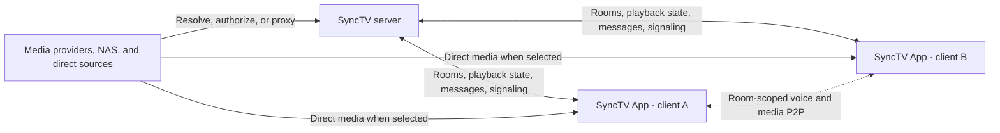

<!-- markdownlint-disable MD013 MD033 MD041 -->

<p align="center">
  
</p>

<h1 align="center">SyncTV App</h1>

<p align="center"><strong>Watch together. Stay in sync.</strong></p>

<p align="center">
  A native, self-hosting-friendly client for synchronized rooms, rich media providers,
  real-time conversation, voice chat, and room-scoped media P2P.
</p>

<p align="center">
  <a href="./README.zh-CN.md">简体中文</a> ·
  <a href="https://syncs.tv">Website</a> ·
  <a href="https://docs.syncs.tv">Documentation</a> ·
  <a href="../../releases/latest">Download</a> ·
  <a href="https://github.com/synctv-org/synctv">Server</a> ·
  <a href="./PRIVACY.md">Privacy</a> ·
  <a href="https://t.me/synctv">Discussion</a>
</p>

<p align="center">
  <a href="../../releases/latest"></a>
  
  
  <a href="./LICENSE"></a>
</p>

## What SyncTV Delivers

- **Synchronized playback**: shared play, pause, seek, speed, source, quality, and playlist navigation with live drift correction.
- **A complete room experience**: discovery, guest access, membership, permissions, favorites, chat, danmaku, playback history, and administration.
- **A broad media surface**: on-demand video, livestreams, direct URLs, HLS, DASH, HTTP-FLV, RTMP, NAS products, private clouds, and media servers.
- **Native viewing workflows**: fullscreen playback, compact player and picture-in-picture, platform volume and brightness controls, and responsive desktop/mobile layouts.
- **Room-scoped communication**: WebRTC voice and optional media P2P with configurable short-lived persistent caching and transfer metrics.
- **Modern authentication**: password, OPAQUE, email, OAuth2, native passkeys, TOTP, recovery flows, and server-directed multi-factor authentication.
- **Multi-server isolation**: credentials, preferences, caches, and identities are separated by normalized server address.

## Product Preview

<p align="center">
  
  &nbsp;&nbsp;&nbsp;
  
</p>

## Media Ecosystem

| Category | Providers and capabilities |
| :--- | :--- |
| Video and livestream platforms | Bilibili, Twitch, YouTube, Douyin, TikTok, Huya, Douyu, AcFun, and CCTV. URL/ID resolution, native qualities, covers, and provider-supported subtitles, danmaku, chat, chapters, or storyboards. |
| Media servers and file services | Emby/Jellyfin, Alist, and Cloudreve. Account binding, browsing, search, thumbnails, subtitles, transcoding, and dynamic sources. |
| NAS and private cloud | FNOS, QNAP, Synology, Nextcloud, Seafile, and TrueNAS. File browsing, search, previews, media libraries, transcoding, favorites, and playback progress where supported. |
| General sources | Direct URL, RTMP, and Live Proxy with custom headers, Range requests, HLS, DASH, HTTP-FLV, and room livestreams. |

Provider capabilities and credentials are decided by the server. The app consumes typed protobuf source configuration and lets users choose individual items, selected items, or dynamic playlists. See the server's [Provider User Guide](https://docs.syncs.tv/en/use/provider-guide/) and [Provider Development Guide](https://docs.syncs.tv/en/develop/provider-development/).

## Architecture



The server remains the authority for rooms, permissions, playback, provider decisions, and P2P swarm identity. Clients may fetch media directly or through the server's proxy according to each playback source.

Contributor-facing layering and test boundaries are documented in [Application Architecture](./docs/architecture.md).

## Platforms and Downloads

| Platform | Minimum | Release artifacts |
| :--- | :--- | :--- |
| Android | Android 7.0 / API 24 | Universal, armv7, arm64, and x64 APKs; universal AAB |
| iOS | iOS 17.4 | Signed IPA for configured releases; re-signable archive for unsigned fork builds |
| macOS | macOS 14.4 | Universal, Apple silicon, and Intel DMG/ZIP packages |
| Windows | Windows 10 1809 | x64 Inno Setup EXE and portable ZIP; supported on Windows ARM64 through x64 emulation |
| Linux | Current Debian/Ubuntu baseline | x64 and ARM64 DEB packages and portable TAR.GZ archives |

Every GitHub Release contains a quick-download matrix and `SHA256SUMS.txt`. Native debug symbols are published separately. Windows ARM64-native output depends on upstream Flutter, media-kit, and WebView2 ARM64 support.

## Quick Start

### Prerequisites

- [FVM](https://fvm.app/) with Flutter `3.44.8` and Dart `3.12.2`.
- Node.js `24` and npm for macOS DMG packaging.
- Rust `1.97.1` for the OPAQUE native asset.
- Protobuf compiler `35.1` and Dart `protoc_plugin 25.0.0` when regenerating API code.
- librsvg and FFmpeg when regenerating app icons.
- The native platform toolchain for the target: Java 17 and Android SDK, Xcode, Visual Studio, or the Linux GTK/WebKit/MPV development packages.

```bash
git clone https://github.com/synctv-org/synctv-app.git
cd synctv-app

fvm install
fvm flutter pub get
fvm dart analyze --fatal-infos
fvm flutter test
fvm flutter run
```

Start a [SyncTV server](https://github.com/synctv-org/synctv) before running the app. Debug builds use `http://127.0.0.1:8080` as the development endpoint. Store and release builds open the server setup flow when no built-in server is configured.

### Regenerate protobuf code

The app owns the protobuf snapshot in `proto/`; generation never reads from a sibling server checkout.

```bash
dart pub global activate protoc_plugin 25.0.0
bash tool/generate_proto.sh
git diff --exit-code -- lib/src/generated
```

### Regenerate app icons

`assets/icon/logo-notext.png` and `assets/icon/logo-notext.svg` are copies of
the designer-provided no-text logo. The generator creates the shared iOS and
macOS Icon Composer package plus the Android, Windows, and Linux formats.
Apple builds require Xcode 26 or newer.

```bash
bash tool/generate_app_icons.sh
```

### Build-time server configuration

Release builds are server-neutral by default. A distributor can embed a server explicitly:

```bash
fvm flutter build apk --release \
  --dart-define SYNCTV_BUILT_IN_SERVER_URL=https://tv.example.com
```

The Release workflow reads two independent repository variables. `SYNCTV_BUILT_IN_SERVER_URL` configures downloadable GitHub Release assets. `SYNCTV_STORE_BUILT_IN_SERVER_URL` configures Google Play, iOS App Store, and Mac App Store builds and resolves to an empty value when unset. `SYNCTV_PASSKEY_RP_IDS` accepts semicolon-separated RP IDs for native passkey association. `SYNCTV_OAUTH2_APP_LINK_ORIGIN` configures the HTTPS origin used by Android Auth Tabs and Apple browser OAuth sessions. Native Sign in with Apple on iOS and macOS uses the signed app Bundle ID and the server's Apple native client secret; it does not use this origin. Windows and Linux use a temporary loopback callback through the system browser.

## Native Passkeys and Self-hosting

Native passkeys rely on an authenticated association between the app identity and the server's RP domain.

- **Android** can connect the official app to any self-hosted domain dynamically. Configure the server with package `org.synctv.app` and the release certificate fingerprints from the `android-passkey-server-config.yaml` attached to official signed releases.
- **Apple platforms** embed allowed RP IDs in the signed app's Associated Domains entitlement. A self-hosted Apple build must include its RP ID in `SYNCTV_PASSKEY_RP_IDS`, use an Apple Developer Team signature, and register `<TeamID>.org.synctv.app` in the server's `webauthn.apple_app_ids`.
- **Sign in with Apple** is one provider with browser and native modes advertised by `supportedModes`. The server must configure `nativeClientId` to match the signed app Bundle ID and keep both Apple client secrets server-side. iOS/macOS choose native authorization; other platforms choose browser authorization. The official build uses `org.synctv.app`; a self-hosted Apple distribution normally needs its own Apple Developer Team, Bundle ID, signing, and client secrets. See [Email and OAuth2](https://docs.syncs.tv/en/configuration/email-oauth2/).
- **Availability is server-directed**. The app exposes native passkeys only when the platform and the selected server association are valid.

The complete server configuration and security model are documented in [WebAuthn and Passkeys](https://docs.syncs.tv/en/configuration/webauthn/).

## Continuous Integration and Releases

The workflows are designed for both the upstream repository and forks. Repository URLs, release links, package metadata, and artifact names are derived from the active GitHub context.

- Every branch push runs formatting, analysis, generated-code checks, and tests.
- Pull requests, the default branch, and manual CI also build Android ARM64, Linux x64/ARM64, Windows x64, macOS Universal, and unsigned iOS releases.
- `v*` tags run the quality gate, build the full artifact matrix, produce checksums and download notes, then publish a GitHub Release.
- Store publication is opt-in and protected through the `google-play` and `app-store` GitHub Environments.

<details>
<summary><strong>Signing and store configuration</strong></summary>

Android release signing uses these repository secrets:

| Secret | Purpose |
| :--- | :--- |
| `SYNCTV_ANDROID_KEYSTORE_BASE64` | Base64-encoded release keystore |
| `SYNCTV_ANDROID_KEYSTORE_PASSWORD` | Keystore password |
| `SYNCTV_ANDROID_KEY_ALIAS` | Release key alias |
| `SYNCTV_ANDROID_KEY_PASSWORD` | Release key password |

Windows Authenticode uses `SYNCTV_WINDOWS_CERTIFICATE_BASE64` and `SYNCTV_WINDOWS_CERTIFICATE_PASSWORD`. The optional `SYNCTV_WINDOWS_TIMESTAMP_URL` variable selects the RFC 3161 timestamp service.

Apple distribution uses these repository variables:

| Variable | Purpose |
| :--- | :--- |
| `SYNCTV_APPLE_DEVELOPMENT_TEAM` | Apple Team ID |
| `SYNCTV_IOS_SIGNING_IDENTITY` | iOS distribution identity |
| `SYNCTV_MACOS_SIGNING_IDENTITY` | Developer ID Application identity |
| `SYNCTV_MACOS_APP_STORE_SIGNING_IDENTITY` | Mac App Store application identity |
| `SYNCTV_MACOS_INSTALLER_SIGNING_IDENTITY` | Mac App Store installer identity |
| `SYNCTV_PUBLISH_APP_STORE_ON_TAG` | Set to `true` to upload Apple builds from version tags |

Apple signing and upload use these secrets:

| Secret | Purpose |
| :--- | :--- |
| `SYNCTV_APPLE_DISTRIBUTION_CERTIFICATE_BASE64` / `..._PASSWORD` | Apple Distribution PKCS#12 |
| `SYNCTV_MACOS_DEVELOPER_ID_CERTIFICATE_BASE64` / `..._PASSWORD` | Developer ID Application PKCS#12 |
| `SYNCTV_IOS_APP_STORE_PROVISIONING_PROFILE_BASE64` | iOS App Store profile |
| `SYNCTV_MACOS_DEVELOPER_ID_PROVISIONING_PROFILE_BASE64` | Developer ID profile |
| `SYNCTV_MACOS_APP_STORE_PROVISIONING_PROFILE_BASE64` | Mac App Store profile |
| `SYNCTV_MACOS_INSTALLER_CERTIFICATE_BASE64` / `..._PASSWORD` | Mac Installer Distribution PKCS#12 |
| `SYNCTV_APP_STORE_CONNECT_KEY_ID` | App Store Connect API key ID |
| `SYNCTV_APP_STORE_CONNECT_ISSUER_ID` | App Store Connect issuer ID |
| `SYNCTV_APP_STORE_CONNECT_PRIVATE_KEY_BASE64` | Base64-encoded `.p8` API private key |

Google Play publication uses `SYNCTV_GOOGLE_PLAY_SERVICE_ACCOUNT_JSON` in the `google-play` Environment. `SYNCTV_GOOGLE_PLAY_APP_SIGNING_SHA256` adds Play App Signing certificate fingerprints to the generated self-hosting configuration.

An empty signing configuration produces development-signed Android APKs, ad-hoc macOS packages, unsigned Windows packages, and a re-signable iOS archive. A partially configured credential group fails early. Apple publishing uploads the canonical screenshots from `fastlane/screenshots`; store price, availability, privacy answers, and review metadata remain managed in App Store Connect or Play Console.

</details>

The authoritative implementations live in [CI](./.github/workflows/ci.yml), [Release](./.github/workflows/release.yml), and the reusable [toolchain setup action](./.github/actions/setup-build/action.yml).

## Repository Layout

| Path | Responsibility |
| :--- | :--- |
| `lib/` | Flutter UI, domain models, state, services, playback, rooms, authentication, and provider flows |
| `proto/` | Public protobuf snapshot consumed by this app |
| `lib/src/generated/` | Generated Dart protobuf code |
| `packages/` | Local media-player integration, OPAQUE native asset, and maintained Darwin passkey fixes |
| `test/` | Unit, widget, protocol, service, and regression tests |
| `android/`, `ios/`, `macos/`, `windows/`, `linux/` | Native runners, permissions, packaging, and platform integration |
| `tool/` | Code generation, local smoke tooling, CI verification, signing, and packaging scripts |
| `fastlane/` | Google Play, iOS App Store, and Mac App Store upload automation |

## Discussion and Contributors

Join the [SyncTV Telegram discussion](https://t.me/synctv) to talk with users and contributors about setup, playback, Providers, self-hosting, and development.


## Privacy and Responsible Use

SyncTV contains no advertising SDK, cross-app tracking, centralized analytics, or automatic crash reporting. Server-specific credentials and cached data remain isolated by normalized server address. Review the [Privacy Policy](./PRIVACY.md) and the selected server operator's policy before connecting accounts or providers.

SyncTV is a general-purpose synchronization client. Users and server operators are responsible for media rights, local law, provider terms, access control, and retention policy.

## License

Licensed under [Apache-2.0](./LICENSE).
