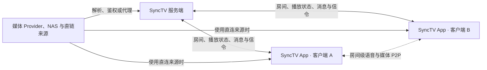

<!-- markdownlint-disable MD013 MD033 MD041 -->

<p align="center">
  
</p>

<h1 align="center">SyncTV App</h1>

<p align="center"><strong>一起看，始终同步。</strong></p>

<p align="center">
  面向原生平台和自托管场景的同步观影客户端，提供房间、媒体 Provider、实时互动、
  语音通话和房间级媒体 P2P。
</p>

<p align="center">
  <a href="./README.md">English</a> ·
  <a href="https://syncs.tv">官方网站</a> ·
  <a href="https://docs.syncs.tv">文档</a> ·
  <a href="../../releases/latest">下载</a> ·
  <a href="https://github.com/synctv-org/synctv">服务端</a> ·
  <a href="./PRIVACY.md">隐私政策</a> ·
  <a href="https://t.me/synctv">讨论</a>
</p>

<p align="center">
  <a href="../../releases/latest"></a>
  
  
  <a href="./LICENSE"></a>
</p>

## 核心体验

- **同步播放**：实时同步播放、暂停、跳转、倍速、来源、画质和播放列表导航，并持续校正播放误差。
- **完整房间体验**：房间发现、游客访问、成员关系、权限、收藏、聊天、弹幕、播放历史和管理能力。
- **广泛的媒体类型**：点播、直播、直链、HLS、DASH、HTTP-FLV、RTMP、NAS、私有云和媒体服务器。
- **原生观看体验**：全屏、小窗和画中画，平台音量与亮度控制，以及桌面端和移动端响应式布局。
- **房间级实时通信**：WebRTC 语音与可选媒体 P2P，支持可配置的短期持久化缓存和传输指标。
- **现代认证体系**：密码、OPAQUE、邮箱、OAuth2、原生 Passkey、TOTP、恢复流程和服务端驱动的多因素认证。
- **多服务器隔离**：凭据、偏好设置、缓存和身份均以规范化服务器地址为隔离边界。

## 产品预览

<p align="center">
  
  &nbsp;&nbsp;&nbsp;
  
</p>

## 媒体生态

| 分类 | Provider 与能力 |
| :--- | :--- |
| 视频与直播平台 | Bilibili、Twitch、YouTube、抖音、TikTok、虎牙、斗鱼、AcFun 和 CCTV。支持 URL/ID 解析、原生清晰度、封面，以及平台提供的字幕、弹幕、聊天、章节或 Storyboard。 |
| 媒体服务器与文件服务 | Emby/Jellyfin、Alist 和 Cloudreve。支持账号绑定、目录浏览、搜索、缩略图、字幕、转码和动态来源。 |
| NAS 与私有云 | FNOS、QNAP、Synology、Nextcloud、Seafile 和 TrueNAS。支持文件浏览、搜索、预览、媒体库、转码、收藏和播放进度等平台能力。 |
| 通用来源 | Direct URL、RTMP 和 Live Proxy，支持自定义 Header、Range 请求、HLS、DASH、HTTP-FLV 和房间直播。 |

Provider 能力和凭据策略由服务端决定。App 使用 typed protobuf source config，并允许用户选择单个条目、部分条目或动态播放列表。详细说明见服务端的 [Provider 使用手册](https://docs.syncs.tv/use/provider-guide/) 和 [Provider 开发指南](https://docs.syncs.tv/develop/provider-development/)。

## 架构



服务端是房间、权限、播放状态、Provider 决策和 P2P Swarm Identity 的权威来源。客户端依据每个 Playback Source 的配置，从媒体来源直连或经过服务端代理获取数据。

## 平台与下载

| 平台 | 最低版本 | 发布产物 |
| :--- | :--- | :--- |
| Android | Android 7.0 / API 24 | Universal、armv7、arm64、x64 APK，以及 Universal AAB |
| iOS | iOS 14 | 已配置正式签名时发布 IPA；fork 无签名构建发布可重签名归档 |
| macOS | macOS 13.5 | Universal、Apple silicon、Intel 三套 DMG/ZIP |
| Windows | Windows 10 1809 | x64 Inno Setup EXE 与便携 ZIP；Windows ARM64 通过 x64 仿真运行 |
| Linux | 当前 Debian/Ubuntu 基线 | x64、ARM64 DEB 与便携 TAR.GZ |

每个 GitHub Release 都包含快速下载矩阵和 `SHA256SUMS.txt`，原生调试符号作为独立产物发布。Windows ARM64 原生产物依赖 Flutter、media-kit 和 WebView2 的上游 ARM64 支持。

## 快速开始

### 环境要求

- 使用 [FVM](https://fvm.app/) 管理 Flutter `3.44.8` 与 Dart `3.12.2`。
- OPAQUE 原生资产使用 Rust `1.97.1`。
- 重新生成 API 代码时需要 Protobuf compiler `35.1` 和 Dart `protoc_plugin 25.0.0`。
- 重新生成应用图标时需要 librsvg 和 FFmpeg。
- 目标平台对应的原生工具链：Java 17 与 Android SDK、Xcode、Visual Studio，或 Linux GTK/WebKit/MPV 开发包。

```bash
git clone https://github.com/synctv-org/synctv-app.git
cd synctv-app

fvm install
fvm flutter pub get
fvm dart analyze --fatal-infos
fvm flutter test
fvm flutter run
```

运行 App 前先启动 [SyncTV 服务端](https://github.com/synctv-org/synctv)。Debug 构建使用 `http://127.0.0.1:8080` 作为开发端点。Store 与 Release 构建在缺少内置服务器配置时进入服务器设置流程。

### 重新生成 protobuf 代码

App 使用 `proto/` 中的 protobuf 快照，生成过程只读取当前仓库。

```bash
dart pub global activate protoc_plugin 25.0.0
bash tool/generate_proto.sh
git diff --exit-code -- lib/src/generated
```

### 重新生成应用图标

`assets/icon/logo-notext.png` 和 `assets/icon/logo-notext.svg` 是设计源文件中
无文字 Logo 的副本。生成脚本会创建 iOS 与 macOS 共用的 Icon Composer 包，
以及 Android、Windows、Linux 所需的格式。Apple 构建需要 Xcode 26 或更高版本。

```bash
bash tool/generate_app_icons.sh
```

### 构建时服务器配置

Release 构建默认保持服务器中立。发行方可以显式内置服务器：

```bash
fvm flutter build apk --release \
  --dart-define SYNCTV_BUILT_IN_SERVER_URL=https://tv.example.com
```

Release workflow 读取两个独立的 repository variable。`SYNCTV_BUILT_IN_SERVER_URL` 配置 GitHub Release 下载包；`SYNCTV_STORE_BUILT_IN_SERVER_URL` 配置 Google Play、iOS App Store 和 Mac App Store 构建，未设置时使用空值。`SYNCTV_PASSKEY_RP_IDS` 使用分号分隔多个 RP ID，供原生 Passkey 关联使用。`SYNCTV_OAUTH2_APP_LINK_ORIGIN` 配置 Android Auth Tab 和 Apple 浏览器 OAuth 会话使用的 HTTPS Origin。iOS/macOS 原生 Sign in with Apple 使用签名 App 的 Bundle ID 和服务端 Apple 原生 client secret，不使用这个 Origin。

## 原生 Passkey 与自托管

原生 Passkey 依赖 App Identity 与服务器 RP Domain 之间经过认证的关联关系。

- **Android** 支持官方 App 动态连接任意自托管域名。服务端需要配置包名 `org.synctv.app`，并使用官方签名 Release 附带的 `android-passkey-server-config.yaml` 获取发布证书指纹。
- **Apple 平台**会把允许的 RP ID 写入签名 App 的 Associated Domains entitlement。自托管 Apple 构建需要在 `SYNCTV_PASSKEY_RP_IDS` 中加入自身 RP ID，使用 Apple Developer Team 签名，并在服务端 `webauthn.apple_app_ids` 中配置 `<TeamID>.org.synctv.app`。
- **Sign in with Apple** 是同一个 provider 的浏览器和原生模式，服务端通过 `supportedModes` 返回能力。`nativeClientId` 必须匹配签名 App 的 Bundle ID，两组 Apple client secret 只保存在服务端。iOS/macOS 选择原生模式，其他平台选择浏览器模式。官方构建使用 `org.synctv.app`；自托管 Apple 发行通常需要自有 Apple Developer Team、Bundle ID、签名和 client secrets。详见 [邮件与 OAuth2](https://docs.syncs.tv/configuration/email-oauth2/)。
- **可用状态由服务端驱动**。平台能力和当前服务器关联关系都有效时，App 才展示原生 Passkey。

完整服务端配置和安全模型见 [WebAuthn 与 Passkey](https://docs.syncs.tv/configuration/webauthn/)。

## 持续集成与发布

Workflow 同时支持官方仓库和 fork。仓库 URL、Release 链接、包元数据和产物名称均从当前 GitHub 上下文生成。

- 每个分支 Push 执行格式检查、静态分析、生成代码校验和测试。
- Pull Request、默认分支和手动 CI 还会构建 Android ARM64、Linux x64/ARM64、Windows x64、macOS Universal 和 unsigned iOS Release。
- `v*` Tag 执行质量门禁、构建完整产物矩阵、生成校验和与下载说明，然后发布 GitHub Release。
- 应用商店发布由 `google-play` 和 `app-store` GitHub Environment 保护，并通过 workflow 显式启用。

<details>
<summary><strong>签名与应用商店配置</strong></summary>

Android Release 签名使用以下 repository secrets：

| Secret | 用途 |
| :--- | :--- |
| `SYNCTV_ANDROID_KEYSTORE_BASE64` | Base64 编码的 Release Keystore |
| `SYNCTV_ANDROID_KEYSTORE_PASSWORD` | Keystore 密码 |
| `SYNCTV_ANDROID_KEY_ALIAS` | Release Key Alias |
| `SYNCTV_ANDROID_KEY_PASSWORD` | Release Key 密码 |

Windows Authenticode 使用 `SYNCTV_WINDOWS_CERTIFICATE_BASE64` 和 `SYNCTV_WINDOWS_CERTIFICATE_PASSWORD`。可选变量 `SYNCTV_WINDOWS_TIMESTAMP_URL` 用于指定 RFC 3161 时间戳服务。

Apple 发行使用以下 repository variables：

| Variable | 用途 |
| :--- | :--- |
| `SYNCTV_APPLE_DEVELOPMENT_TEAM` | Apple Team ID |
| `SYNCTV_IOS_SIGNING_IDENTITY` | iOS Distribution Identity |
| `SYNCTV_MACOS_SIGNING_IDENTITY` | Developer ID Application Identity |
| `SYNCTV_MACOS_APP_STORE_SIGNING_IDENTITY` | Mac App Store App Identity |
| `SYNCTV_MACOS_INSTALLER_SIGNING_IDENTITY` | Mac App Store Installer Identity |
| `SYNCTV_PUBLISH_APP_STORE_ON_TAG` | 设置为 `true` 后从版本 Tag 上传 Apple 构建 |

Apple 签名与上传使用以下 secrets：

| Secret | 用途 |
| :--- | :--- |
| `SYNCTV_APPLE_DISTRIBUTION_CERTIFICATE_BASE64` / `..._PASSWORD` | Apple Distribution PKCS#12 |
| `SYNCTV_MACOS_DEVELOPER_ID_CERTIFICATE_BASE64` / `..._PASSWORD` | Developer ID Application PKCS#12 |
| `SYNCTV_IOS_APP_STORE_PROVISIONING_PROFILE_BASE64` | iOS App Store Profile |
| `SYNCTV_MACOS_DEVELOPER_ID_PROVISIONING_PROFILE_BASE64` | Developer ID Profile |
| `SYNCTV_MACOS_APP_STORE_PROVISIONING_PROFILE_BASE64` | Mac App Store Profile |
| `SYNCTV_MACOS_INSTALLER_CERTIFICATE_BASE64` / `..._PASSWORD` | Mac Installer Distribution PKCS#12 |
| `SYNCTV_APP_STORE_CONNECT_KEY_ID` | App Store Connect API Key ID |
| `SYNCTV_APP_STORE_CONNECT_ISSUER_ID` | App Store Connect Issuer ID |
| `SYNCTV_APP_STORE_CONNECT_PRIVATE_KEY_BASE64` | Base64 编码的 `.p8` API 私钥 |

Google Play 发布使用 `google-play` Environment 中的 `SYNCTV_GOOGLE_PLAY_SERVICE_ACCOUNT_JSON`。`SYNCTV_GOOGLE_PLAY_APP_SIGNING_SHA256` 会把 Play App Signing 证书指纹加入自动生成的自托管配置。

空签名配置会生成 development-signed Android APK、ad-hoc macOS 包、unsigned Windows 包和可重签名 iOS 归档。凭据组只配置一部分时会提前失败。Apple 发布会上传 `fastlane/screenshots` 中的规范截图；商店价格、销售地区、隐私问卷和审核资料在 App Store Connect 或 Play Console 管理。

</details>

权威实现位于 [CI workflow](./.github/workflows/ci.yml)、[Release workflow](./.github/workflows/release.yml) 和复用的 [工具链 Setup Action](./.github/actions/setup-build/action.yml)。

## 仓库结构

| 路径 | 职责 |
| :--- | :--- |
| `lib/` | Flutter UI、Domain Model、状态、Service、播放器、房间、认证和 Provider 流程 |
| `proto/` | App 使用的公开 protobuf 快照 |
| `lib/src/generated/` | 生成的 Dart protobuf 代码 |
| `packages/` | 本地播放器集成、OPAQUE 原生资产和维护中的 Darwin Passkey 修复 |
| `test/` | Unit、Widget、协议、Service 和回归测试 |
| `android/`、`ios/`、`macos/`、`windows/`、`linux/` | 原生 Runner、权限、打包和平台集成 |
| `tool/` | 代码生成、本地 Smoke Tool、CI 校验、签名和打包脚本 |
| `fastlane/` | Google Play、iOS App Store 和 Mac App Store 上传自动化 |

## 讨论与贡献者

加入 [SyncTV Telegram 讨论组](https://t.me/synctv)，与用户和贡献者交流部署、播放、Provider、自托管和开发问题。


## 隐私与合理使用

SyncTV 不包含广告 SDK、跨应用跟踪、集中式分析或自动崩溃上报。服务器凭据和缓存数据以规范化服务器地址为隔离边界。连接账号或 Provider 前，请阅读 [隐私政策](./PRIVACY.md) 和所选服务器运营方的政策。

SyncTV 是通用媒体同步客户端。用户和服务器运营方负责媒体权利、当地法律、Provider 条款、访问控制和数据保留政策。

## 开源协议

本项目使用 [Apache-2.0](./LICENSE) 协议。
